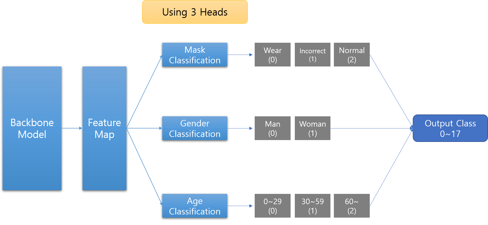

# Project: Mask Image Classification
The problem of classifying a given person image by 3-criteria
 - Mask Wear Form: `Not wear`, `Incorrect`, `Wear`
 - Gender: `Male`, `Female`
 - Age: `0 to 29`, `30 to 59`, `60~`
<br> <br>

**Model Structure**
> Fine Tuning with using 3 additional Heads(each for Mask wear form, gender and age) with Pre-Trained Models
 - Backbone Model: `ResNet50`, `EfficientNet-b4`, `ResNest200e`, `Vit`



## Task Description
With the spread of COVID-19, people in our country as well as around the world have many restrictions on economic and productive activities. The most important thing to prevent the spread of infection is to cover everyone's nose and mouth with a mask to block the transmission route from any possible infected person.

To do this, people in public places must wear masks, and above all, it is important to wear them properly so that they can cover their nose and mouth completely. However, additional human resources will be needed to check everyone's correct wearing of masks in large public areas.

Therefore, we need a system that can automatically identify whether this person is wearing a mask, not wearing it, or wearing it correctly, just by the image of the person's face shown on the camera. If this system is in place at the entrance to public spaces, it will be sufficiently inspected with a small amount of human resources.

## Requirements
>We confirmed that it runs on Ubuntu 18.04, Python 3.7, and pytorch 1.7.1.

The necessary packages can be installed with the command below.
```
pip install -r requirements.txt
```

## Getting Started

### Step 1: Download Source Code
 - `augmentation.py`: augmentation methods for training
 - `loss.py`: loss functions for backward propagation (classification)
 - `optimizer.py`: optimizers for updating parameters
 - `scheduler.py`: schedulers for learning rate
 - `pytorch_tools.py`: using early stopping
 - `preprocess.py`: make new data csv file for correct validation
 - `mask_dataset.py`: pytorch dataset for both training & Inference
 - `mask_model.py`: CNN models using various CNN backbone
 - `train.py`: training model with using various hyperparmeters
 - `inference.py`: make prediction by trained models

 ### Step 2: Preparing Datset
 ```
 +-- train/
|   +-- images/
|       +-- 000001_female_Asian_45/
|       +-- 000002_female_Asian_52/
|       +-- …
|   +-- train.csv
+-- public/
|   +-- images/
|       +-- 814bff668ae5b9c595ceabcbb6e1ea84634afbd6.jpg
|       +-- 819f47db0617b3ea9725ef1f6f58e56561e7cb4b.jpg
|       +-- …
|   +-- info.csv
+-- private/
    +-- images/
        +-- 0001b62fb1057a1182db2c839de232dbef0d1e90.jpg
        +-- 10006ee2ebd5a23196ee3bda4d7e06489ed40ce7.jpg
        +-- …
    +-- info.csv
```
by using `preprocessing.py` make new csv file for preventing data leakage when splitting train-validation dataset
```
python3 ./preprocess.py
```

### Step 3: Training Model with various hyperparameters
```
python3 ./train.py
--csv_path="train_st_df_58.csv"
--lr=0.006
--batch_size=64
--nworkers=4
--nepochs=70
--seed=42
--patience=30
--resize_width=380
--resize_height=380
--model="EfficientNetMaskClassifier"
--kfold=2
--train_augmentation="ResizeVariousAugmentation" 
--test_augmentation="BaseAugmentation"
--optimizer="SGDP"
--criterion="label_smoothing"
--scheduler="OneCycleLR"
--description="age filter + SGDP + Data Aug + label smoothing(for mask & age) + onecycleLR"
```

### Step 4: Make Predictions
```
python3 ./inference.py
--batch_size=1
--nworkers=4
--seed=42
--model="EfficientNetMaskClassifier"
--test_augmentation="BaseAugmentation"
--model_version=0408_1400
--model_epoch=27